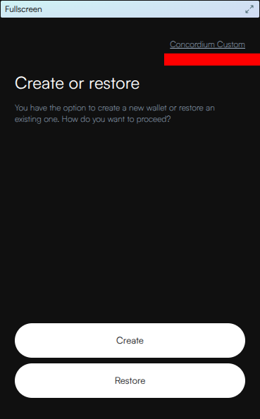
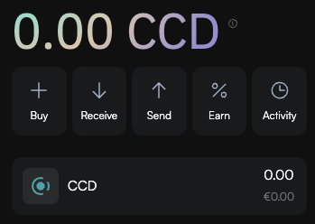

# Concordium P9 Localnet

This repo provides everything you need to run a local Concordium blockchain for development and testing. The setup includes:

* **P9 Node** with GRPC on port 20100
* **Test Identity Provider** for wallet ID issuance
* **Wallet Proxy** on port 7013
* **CCDScan Explorer** on port 7016
* **PostgreSQL Database** supporting wallet proxy & CCDScan
* **pgAdmin** on port 8432 for database management
* **Web Server** on port 7020 for PLT token metadata

## Prerequisites

Before starting, you'll need to install the following tools:

### 1. Install Docker Desktop

Download and install Docker Desktop from [docker.com](https://www.docker.com/products/docker-desktop/)

**For Apple Silicon Macs:** After installing Docker Desktop, enable Rosetta emulation:
1. Open Docker Desktop
2. Go to Settings (gear icon)
3. Navigate to **General**
4. Check **"Use Rosetta for x86_64/amd64 emulation on Apple Silicon"**
5. Click **Apply & Restart**

### 2. Install jq

**macOS:**
```bash
brew install jq
```

**Verify installation:**
```bash
jq --version
```

### 3. Download the concordium-client tool

Download the concordium-client tool for your platform from the [developer documentation](https://docs.concordium.com/en/mainnet/tools/concordium-client.html#run-concordium-client).

**Verify installation:**
```bash
concordium-client --version
```

This should display version `9.1.4` or similar.

#### Troubleshooting

**"concordium-client: command not found"**

If you encounter this error, it means your system cannot locate the `concordium-client` binary. Make sure it is in your PATH.

### 4. Get the genesis-creator tool

You can either download or build the genesis-creator tool.

- Option 1: **Build the genesis-creator tool**

You can build the binary from the source code.

#### Install Rust (required for genesis-creator)

If you don't have Rust installed:
```bash
curl --proto '=https' --tlsv1.2 -sSf https://sh.rustup.rs | sh
```

Follow the prompts, then restart your terminal.

#### Install genesis-creator

```bash
cargo install --git https://github.com/Concordium/concordium-misc-tools genesis-creator
```

**Verify installation:**
```bash
genesis-creator --version
```

This should display version `0.6.0` or similar.

- Option 2: **Download the genesis-creator tool (for ubuntu)**

You can instead of building from the source code also download the genesis-creator tool for your platform from some recent [github release artefacts](https://github.com/Concordium/concordium-misc-tools/releases/tag/genesis-creator%2F0.6.0).
Note: As the binary for `macOS` and `windows` are unsigned, you will get security warnings
when running the binary on these platforms. If you prefer to build the binary yourself because of that, use the Option 1 above instead.

**Verify installation:**
```bash
genesis-creator --version
```

This should display version `0.6.0` or similar.

#### Troubleshooting

**"genesis-creator: command not found"**

If you encounter this error, it means your system cannot locate the `genesis-creator` binary. Make sure it is in your PATH.

## Setup Instructions

### Step 1: Clone the Repository

```bash
git clone <repository-url>
cd local-p9-stack
```

### Step 2: Initialize the Genesis Block

Run the initialization script to generate the genesis block and configuration files:

```bash
./initialise.sh
```

You should see output indicating successful creation of accounts, bakers, identity providers, and the genesis block.

### Step 3: Start the Localnet

Start all services using Docker Compose:

```bash
docker compose up --detach
```

**Verify all services are running:**
```bash
docker compose ps
```

All containers should show status "Up". If any services failed to start, check the logs:
```bash
docker compose logs <service-name>
```

### Step 4: Configure the Concordium Wallet

1. **Install the Concordium Wallet for Web** from the [Chrome Web Store](https://chromewebstore.google.com/detail/concordium-wallet/mnnkpffndmickbiakofclnpoiajlegmg)

2. **Configure the custom network BEFORE setting up your seed phrase:**



   - Node Address: `http://localhost`
   - Node Port: `20100`
   - Wallet Proxy: `http://localhost:7013`
   - CCDscan URL: `http://localhost:7016`


3. **Complete wallet setup** by creating your seed phrase

### Step 5: Request an Identity and Create an Account

1. In the wallet, request an ID from the test identity provider (it's the only one available)
2. Once your identity is approved, create an account
3. Your account will initially have 0 CCD

### Step 6: Fund Your Account

To receive test CCD tokens:
1. Click the **Activity** icon in your newly created account
2. Click **Request CCD**
3. You'll receive 20,000 CCD (the default drop amount)




## Creating PLT Tokens

You can create custom PLT (Protocol-Level Tokens) tokens using the provided script:

```bash
./make-plts.sh
```

The script will prompt you for:
- **Token ID**: Unique identifier for your token
- **Token Name**: Display name
- **Token Description**: Brief description
- **Number of Decimals**: Precision (e.g., 6 for micro-units)
- **Initial Supply**: Starting token amount
- **Governance Address**: Copy this from your wallet account

**Token Configuration:**
- PLTs are created with a deny list (but no allow list)
- Minting and burning capabilities are enabled
- Token metadata files are stored in `webserver/metadata/`
- You can customize token icons using the PNG files in `webserver/images/`

## Useful Commands

### Managing the Localnet

```bash
# Stop all services
docker compose down

# Stop and remove all data (fresh start)
docker compose down -v

# View logs from all services
docker compose logs -f

# View logs from a specific service
docker compose logs -f local-node

# Restart services
docker compose restart
```

### Accessing Services

- **CCDScan Explorer**: http://localhost:7016
- **Wallet Proxy**: http://localhost:7013
- **pgAdmin**: http://localhost:8432 (user: `test@company.com`, password: `password`)
- **Token Metadata Server**: http://localhost:7020
- **Node GRPC**: http://localhost:20100

### Source Code of Services

- **Blockchain Node**: [source code](https://github.com/Concordium/concordium-node)
- **CCDScan Explorer**: [source code](https://github.com/Concordium/concordium-scan)
- **Wallet Proxy**: [source code](https://github.com/Concordium/concordium-wallet-proxy)

## Troubleshooting

### Services won't start
```bash
# Check which containers are running
docker compose ps -a

# Check logs for errors
docker compose logs
```

### PostgreSQL errors
```bash
# Restart with clean database
docker compose down -v
docker compose up --detach
```

### Platform warnings on Apple Silicon
Warnings like `The requested image's platform (linux/amd64) does not match` are normal and can be ignored if Rosetta is enabled in Docker Desktop.

## Development Tips

- The node data is stored in `./local-node/` and persists between restarts
- Database data is stored in a Docker volume and persists unless you use `docker compose down -v`
- You can edit token metadata files in `webserver/metadata/` while the services are running
- CCDScan may take a few moments to sync after startup

Enjoy building on Concordium! 🚀